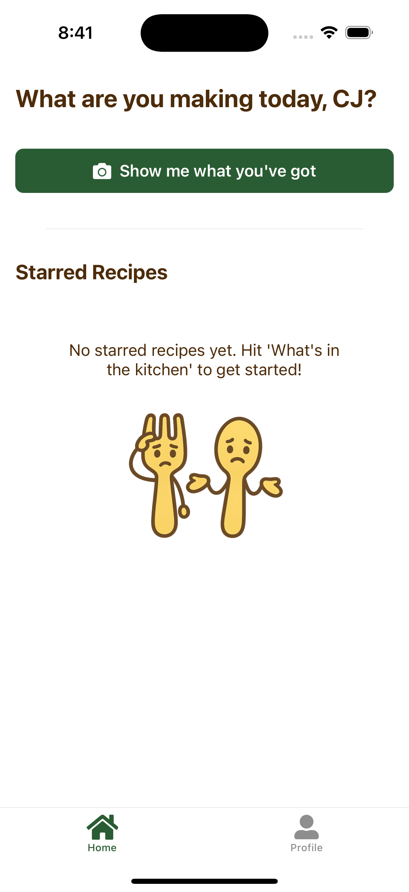
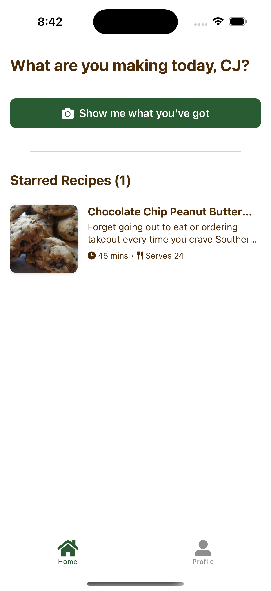
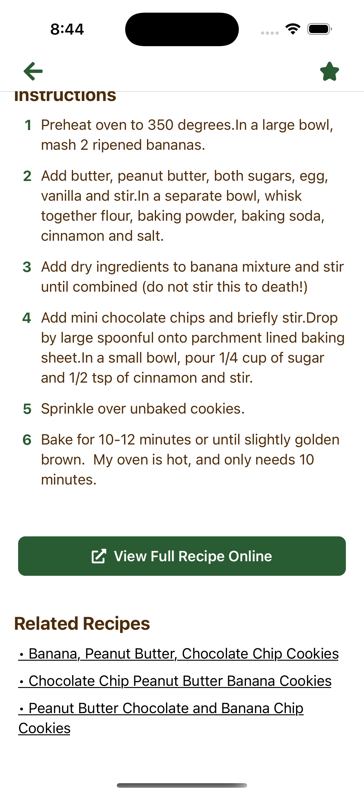

# Meal Mate 🍳📸

<p align="center">
  
   
  
  
</p>

Meal Mate is a smart recipe planner built with React Native and Expo. It allows users to take a photo of ingredients and receive recipe suggestions.

## Overview

Hi Arman and Alex! Thank you for the opportunity to interview for Tenex. This project was quite fun, and I hope you enjoy the result as much as I do.

For the strategy question, I put my answer [here.](./strategyQuestion.md)

For the engineering project, I chose the smart recipe planner and built an app called Meal Mate. Meal Mate uses GPT-4o vision to detect ingredients in the photos uploaded by the user and then uses the [Spoonacular API](https://spoonacular.com/food-api) to search for matching recipes.

Below are the steps to clone and run this project. At the bottom of this README, I include more information about how this was built and my approach.

## Getting Started

1.  **Clone the repository:**
    ```bash
    git clone https://github.com/hesscbjr/mealmate.git
    cd mealmate
    ```
2.  **Install dependencies:**
    ```bash
    npx expo install
    ```
3.  **Set up environment variables:**
    Create a `.env` file in the root directory and add the neccessary environment variables for OpenAI and Spoonacular. A link to these keys is in my original submission email sent via a secure note.
    ```dotenv
    # .env
    EXPO_PUBLIC_OPENAI_API_KEY=<OPENAI_API_KEY>
    EXPO_PUBLIC_SPOONACULAR_API_KEY=<SPOONACULAR_API_KEY>
    ```
4.  **Run the app:**
    To run the app, run one of the commands below to install and run the app on either an android or ios simulator

    ```bash
    # Run on iOS simulator (requires Xcode)
    npx expo run:ios

    # Run on Android emulator/device (requires Android Studio setup)
    npx expo run:android
    ```

## Features

### Image to Ingredient Scanning

Take or select a photo from your camera roll to have GPT-4o extract the ingredients in the image.

- **How it works:** I send the image data to GPT-4o with a custom prompt designed to extract ingredients in JSON format, ensuring a structured and clean output.

### Recipe Search Based on Ingredients

Display a list of 5 recipes based on the ingredients extracted from your photo.

- **How it works:** I use the extracted ingredients from GPT-4o and make a custom call to the Spoonacular API to retrieve matching recipes.

### Recipe Refresh

Get a new batch of 5 recipes if you don't like the current suggestions.

- **How it works:** Each time the user refreshes, I increment the Spoonacular API offset by 5 to ensure new, non-repeating recipes are fetched.

### Starred Recipes

Save your favorite recipes for quick access later.

- **How it works:** Users can "star" any recipe they like. Starred recipes are managed through a Zustand store and saved locally with AsyncStorage.

<p align="center">
  
  
  
</p>

### Related Recipes

Discover additional recipes based on the one you're viewing.

- **How it works:** Spoonacular API provides related recipes with links. I parse the recipe IDs and create internal links so users can easily navigate to new recipe pages within the app.

<p align="center">
  
</p>

### Light and Dark Mode

The app supports both light and dark themes, selectable from the profile page.

- **How it works:** I implemented a theme selector that lets users pick light, dark, or system mode with persistent storage using Zustand and AsyncStorage.

<p align="center">
  
  
</p>

## Limitations

### Lots of Ingredients

GPT-4o performs well when recognizing up to around 15 ingredients in an image. Beyond that, its accuracy drops and it may miss or incorrectly identify some ingredients.

- **Future Improvement:** Add a "Confirm Ingredients" step where users can review, edit, or add ingredients before recipe generation.

### Recipe Results

Spoonacular only allows for a single `sort` param with values `min-missing-ingredients` or `max-used-ingredients`.

With `min-missing-ingredients` you won't necessarily use all the ingredients in your photo. This often results in recipes with 3-5 ingredients that are simple and don't use all the ingredients you supplied.

With `max-used-ingredients` you often end up with recipes that require many more ingredients than you supplied.

- **Current Handling:** Users can select if they want to have the minimal missing ingredients or the maximal used ingredients in their search from the profile page.

<p align="center">
  
  
</p>

- **Future Improvement:** Use a different API or pull all results and process the data to optimize for the recipes with the maximal used ingredients **and** the minimal missing ingredients.

### Bad Instructions

Some recipes returned by the Spoonacular API have poorly formatted or grammatically incorrect instructions. As you can see below, I think you need the oven to be a bit hotter than 35 degrees...

- **Future Improvement:** Use a more curated recipe database or implement a post-processing step to clean and standardize instructions.

<p align="center">
  
</p>

### Related Recipes

Occasionally, Spoonacular returns related recipe links that are broken or invalid.

- **Current Handling:** If a broken link is detected, the app shows a "Not Found" error and redirects the user back to a safe screen.

<p align="center">
  
</p>

## Thank You

Thank you so much for taking the time to review this project and for considering me for the team.

I had a lot of fun building Meal Mate and thinking through both the technical and product sides of the challenge.

I'm really excited about what you're building at Tenex and would love the chance to be a part of it!
